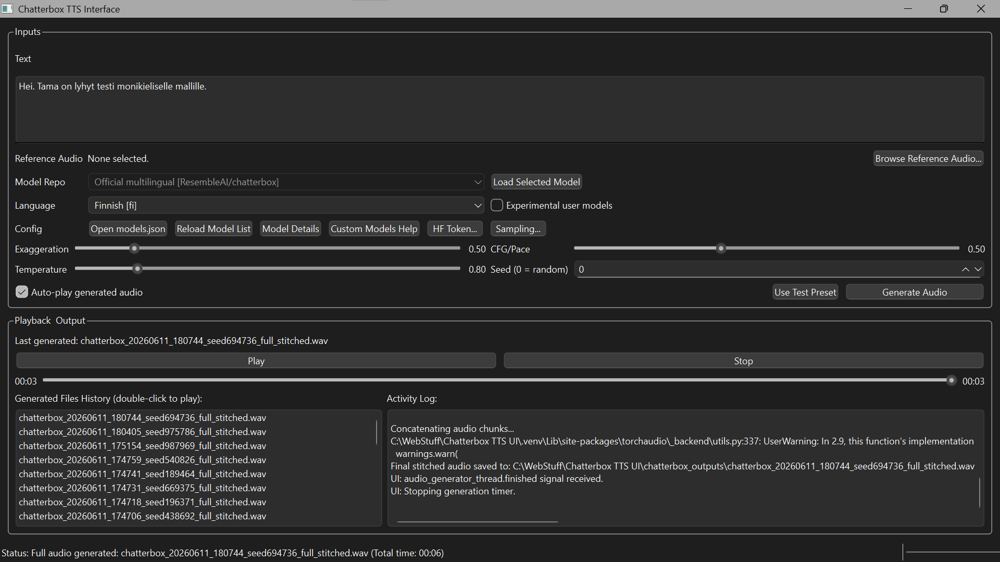

# Chatterbox TTS - One Click Installer & UI
<!-- ALL-CONTRIBUTORS-BADGE:START - Do not remove or modify this section -->
[](#contributors-)
<!-- ALL-CONTRIBUTORS-BADGE:END -->

This project provides a PySide6 desktop interface for Resemble AI's open-source **Chatterbox TTS** models, along with a Windows-first setup flow that prepares the environment, installs a suitable PyTorch runtime, and launches the app.

Current recommended launcher flow:

*   `run.bat`: launches the app once after running environment setup.
*   `setup_env.bat`: prepares or repairs the local environment and writes installer logs.
*   `run.sh` + `setup_env.sh`: best-effort shell launcher/setup flow for macOS/Linux, not yet validated to the same level as Windows.

Windows remains the primary maintained path.


## Table of Contents

* [Features](#features)
* [Language Support](#language-support)
* [Prerequisites](#prerequisites)
* [Installation & Usage](#installation--usage)
* [Manual Installation (Advanced)](#manual-installation-advanced)
* [Project Structure](#project-structure)
* [Troubleshooting](#troubleshooting)
* [Important Notes on PyTorch Installation](#important-notes-on-pytorch-installation--reproducibility)
* [Contributing](#contributing)
* [Acknowledgements](#acknowledgements)

## Screenshot

<details>
<summary><strong> Check this beautiful UI </strong>- Click to expand</summary>


*(Early Stage of the App UI)*
</details>

## Language Support

<details>
<summary><strong>Official Model Capabilities (Current UI)</strong> - Click to Expand</summary>

*   The default shipped model entry is the official `ResembleAI/chatterbox` multilingual backend.
*   The current upstream multilingual backend exposes these official language IDs:
    *   `ar`, `da`, `de`, `el`, `en`, `es`, `fi`, `fr`, `he`, `hi`, `it`, `ja`, `ko`, `ms`, `nl`, `no`, `pl`, `pt`, `ru`, `sv`, `sw`, `tr`, `zh`
*   The UI now includes:
    *   a backend-aware model selector
    *   an explicit language selector for multilingual models
    *   editable `models.json` entries for custom repo testing
    *   `multilingual_t3_model` support in `models.json` for multilingual entries (`v3` by default, `v2` for older repos if needed)
*   The app also keeps an optional `Legacy English compatibility` entry for testing the older English-focused loader path.
*   **Not every Hugging Face repo is compatible.** A repo must match the expected checkpoint layout for the selected backend (`multilingual` or `legacy`), otherwise the UI will show a compatibility error.
</details>

<details>
<summary><strong>Notes on Bulgarian and Custom Models</strong> - Click to Expand</summary>

*   **Bulgarian is not part of the current official multilingual language list** exposed by `ResembleAI/chatterbox`.
*   The UI supports custom repos through `models.json`, but that does **not** guarantee the repo is usable with the selected backend.
*   The included disabled example entries in `models.json` are there to show users how to add custom multilingual or legacy repos without editing Python code.
</details>

## Features

<details>
<summary>Click to expand</summary>

*   **Simple PySide6 Interface:**
    *   Sidebar layout with **Generate**, **Voice**, **Model** and **Log** pages, and a light/dark theme (amber accent) that follows the Windows app mode.
    *   Plain-language delivery controls: Expressiveness (exaggeration), Pacing (CFG weight), Variation (temperature) and Take number (seed); hover any control for details.
    *   **Finishing touches** (applied after generation): pause between long-text sections, even-out volume, silence trimming, and lossless WAV/FLAC output. Settings are remembered between sessions.
    *   **Advanced page:** speed and pitch (FFmpeg Rubber Band with formant preservation when available, librosa otherwise) and MP3 export, with a note that these can weaken the inaudible AI watermark. The Finishing touches summary flags them while active.
    *   **Qwen3-TTS engine (optional, Apache-2.0):** three extra models appear in the model switcher:
        *   *Qwen3 preset voices* - nine built-in speakers you can steer with a plain-language style ("excited and upbeat", "whisper softly").
        *   *Qwen3 voice design* - describe a voice ("a calm, low narrator voice with a slight rasp") and Qwen creates it.
        *   *Qwen3 voice cloning* - clones the reference clip from the Voice page; recordings made with **Record...** save the passage you read as a transcript, which improves likeness.
        *   Qwen needs different library versions than Chatterbox (`transformers` 4.57 vs 5.2), so it runs in its own environment (`engines/qwen/.venv`) as a background worker. Loading a Qwen model for the first time offers to install it. Qwen output can optionally get the same Perth AI watermark Chatterbox uses (**Add AI watermark**, on by default).
        *   Long text is generated in batches of up to 16 sections per call on the GPU, which is several times faster than one section at a time (an 18-section document: about 1 min 50 s instead of about 10 min on an RTX 5070 Ti). If a batch doesn't fit in GPU memory it is split automatically.
    *   **Documents:** open `.txt`, `.md` or `.docx` files, see the character count, section count and an estimated generation time (learned from your own runs), and **Preview** a short sample (your selection, or the opening section) before rendering everything. *Keep this take* locks the preview's take number so the full render matches. Long renders show section progress with time remaining, and **Stop** saves the finished sections as a `_partial` file.
    *   Text input for speech synthesis.
    *   Load reference audio files (`.wav`, `.mp3`, `.flac`) for voice cloning.
    *   Record a reference clip from a microphone directly in the app.
    *   Model switcher on the Generate page; the **Model** page lists every model with its engine, languages and download status, and lets you add, edit, duplicate or remove entries (saved to `models.json` for you). **Check** looks a repo up on Hugging Face, detects which engine can load it, and shows the download size before anything is downloaded.
    *   Explicit language selector for multilingual models.
    *   Hugging Face token field with a **Test** button (stored locally in `app_settings.json`, never in `models.json`) and a collapsible **Fine-tuning** section for repetition control, min-p and top-p.
    *   Per-model notes and language-specific test presets.
    *   Adjustable parameters:
        *   Exaggeration
        *   CFG/Pace
        *   Temperature
        *   Random Seed (0 for random)
        *   Advanced sampling settings: repetition penalty, min-p, and top-p
    *   Audio playback controls (Play/Pause/Resume, Stop, Seekable Playhead).
    *   Split lower panel with generated file history and an in-app `Activity Log`.
    *   Status updates for model loading, generation,  playback and time elapsed.
    *   Option to auto-play audio after generation.
*   **Smart Text Chunking:**
    *   Utilizes NLTK for sentence tokenization.
    *   Long sentences are intelligently split at spaces to avoid cutting words, ensuring better quality for stitched audio.
    *   Handles long text inputs by generating and stitching audio chunks.
*   **Windows Setup Flow (`run.bat` + `setup_env.bat`):**
    *   Uses `uv` (a fast Python package installer and resolver) for environment setup.
    *   Automatically creates a Python virtual environment (`.venv`).
    *   Installs base application dependencies from `requirements.lock.txt`.
    *   Detects your NVIDIA CUDA runtime and installs a suitable PyTorch build separately from the main dependency lock.
    *   Writes timestamped installer logs to the `logs/` folder.
    *   Downloads necessary NLTK resources (`punkt` for sentence tokenization).
*   **Output Management:**
    *   Saves generated audio to a `chatterbox_outputs` subdirectory.
    *   Filenames include timestamps and the actual seed used for generation.

</details>

## Prerequisites

<details>
<summary>Click to expand</summary>

1.  **Python:** Version 3.11 is the current supported target for the Windows launcher flow.
2.  **`uv`:** This ultra-fast Python package manager.
    *   Installation instructions: [https://github.com/astral-sh/uv#installation](https://github.com/astral-sh/uv#installation)
3.  **FFmpeg:** Required by Qt Multimedia for playing various audio formats (including the generated `.wav` files).
    *   Download FFmpeg from [https://ffmpeg.org/download.html](https://ffmpeg.org/download.html).
    *   Extract it and **add the `bin` directory (containing `ffmpeg.exe`, `ffplay.exe`, `ffprobe.exe`) to your system's PATH environment variable.**
4.  **NVIDIA GPU (Optional, for GPU acceleration):**
    *   If you have an NVIDIA GPU, ensure you have the latest drivers installed. The installer will attempt to detect your CUDA version.
5.  **Internet Connection:** Required for downloading dependencies during the first setup.
</details>

## Installation & Usage

<details>
<summary>Click to expand</summary>

1.  **Clone or Download this Repository:**
    ```bash
    git clone https://github.com/actepukc/chatterbox-tts-ui
    cd chatterbox-tts-ui
    ```
    Or download the ZIP and extract it.
    (Remove the screenshot or print it as a memory)
2.  **Run the Launcher:**
    *   Simply double-click `run.bat`.
    *   This script will:
        *   Call `setup_env.bat` to prepare or repair the environment.
        *   Create `.venv` if needed.
        *   Install or refresh base dependencies.
        *   Run `install_torch.py` only when the Torch runtime needs to be installed or repaired.
        *   Launch the `main.py` application once setup succeeds.

    *   **Important:** the first launch can take several minutes.
        *   The UI may not appear immediately.
        *   The model can still be downloading after the app window appears.
        *   Installer decisions and failures are written to `logs\installer_YYYYMMDD_HHMMSS.log`.
        *   Pre-window startup crashes are written to `logs\app_startup_YYYYMMDD_HHMMSS.log`.
    *   Subsequent launches should be much faster, but the launcher still performs quick environment checks before starting the app.

3.  **Using the Application (`main.py`):**
    *   **Load Model:** The default model loads automatically on startup. Pick another model in the Generate page's model switcher, or use **Load this model** on the Model page.
    *   **Custom repos:** on the Model page click **+ Add model...**, enter the Hugging Face repo, click **Check**, then **Save**. Entries can be hidden from the switcher without deleting them.
    *   **Optional HF token:** paste it under **Hugging Face access** on the Model page and click **Save** (use **Test** to confirm it works). Only needed for gated or private repos or higher download limits.
        *   Get one from [Hugging Face Settings > Access Tokens](https://huggingface.co/settings/tokens).
        *   Create a token with `Read` access.
        *   Paste it into the app.
        *   It applies to future Hugging Face downloads in the current session, but restarting the app is recommended so startup downloads also use it cleanly.
        *   The token is saved locally in `app_settings.json`, which is ignored by git and should not be shared.
    *   **Enter Text:** Type or paste the text you want to synthesize. Long texts will be automatically chunked and stitched.
    *   **Reference Audio (Optional):** Click "Browse Reference Audio..." to select a `.wav`, `.mp3`, or `.flac` file to clone its voice characteristics.
        *   Or pick a microphone and click **Record...**. A recording window counts down from 3 (the live level meter doubles as a mic check), then records while showing elapsed time, a scrolling input-level graph and a too-quiet/clipping indicator. Read the suggested passage aloud (about 15 seconds; each passage covers every English vowel and consonant sound and includes a question and an exclamation for inflection), then click **Stop & Use**. Stop is available after 3 seconds and recording stops automatically at 30 seconds. The clip is saved to `reference_recordings/` (ignored by git) and selected automatically.
        *   Chatterbox conditions mostly on the first 6-10 seconds of the reference and uses the whole clip for the speaker embedding, so start speaking right away and keep the room quiet.
    *   **Adjust Parameters:** Use the sliders and seed input to fine-tune the output.
        *   **CFG/Pace:** Lower values (e.g., 0.2-0.4) can slow down speech and improve pacing.
        *   **Exaggeration:** Default 0.5 is usually good. Higher values can be more expressive but also faster.
        *   **Fine-tuning (Model page):** repetition control, unlikely-sound filter (min-p) and top-p for advanced users.
    *   **Generate Audio:** Click "Generate Audio". The status bar will show progress if the text is split into multiple chunks.
    *   **Playback:**
        *   If "Auto-play" is checked, audio plays automatically.
        *   Use the Play/Pause, Stop, and seek slider.
        *   Double-click files in the "Generated Files History" to play them.
        *   Watch the `Activity Log` panel for model downloads, warnings, and tracebacks.
    *   Generated files are saved in the `chatterbox_outputs` folder.
</details>

## Manual Installation (Advanced)
<details>
<summary>Click to expand</summary>

### macOS / Linux

*   `run.sh` now mirrors the split launcher/setup pattern used on Windows through `setup_env.sh`, but it is still **best-effort / experimental**.
*   If you are on macOS or Linux, manual setup is still the safest fallback.
*   Apple Silicon / MPS users should install a suitable PyTorch build manually after the base dependencies are installed if the automatic Torch step is not appropriate for their machine.
If you prefer not to use the `run.bat` script or are on a different OS:

1.  Ensure **Python 3.11** (or compatible) and **`uv`** are installed and in your PATH.
2.  Ensure **FFmpeg** is installed and its `bin` directory is in your PATH.
3.  Open a terminal in the project directory.
4.  Create and activate a virtual environment:
    ```bash
    uv venv .venv --python 3.11 
    # On Windows:
    .\.venv\Scripts\activate
    # On macOS/Linux:
    source .venv/bin/activate
    ```
5.  Install dependencies from the lock file:
    ```bash
    uv pip sync requirements.lock.txt
    ```
6.  Install the correct PyTorch version:
    ```bash
    python install_torch.py
    ```
7.  Run the application:
    ```bash
    python main.py
    ```
</details>

## Project Structure
<details>
<summary>Click to expand</summary>

*   `main.py`: The main PySide6 application script.
*   `run.bat`: Windows launcher. Runs setup, then starts the app once.
*   `launch_app.py`: Startup wrapper that logs pre-GUI crashes to `logs/app_startup_*.log`.
*   `setup_env.bat`: Windows environment setup and repair script.
*   `run.sh`: Shell launcher. Runs `setup_env.sh`, then starts the app.
*   `setup_env.sh`: Best-effort shell environment setup and repair script for macOS/Linux.
*   `model_backends.py`: Backend-aware Chatterbox model loading adapter.
*   `model_registry.py`: Engine definitions, `models.json` saving, download status and the Hugging Face repo check used by the Model page.
*   `qwen_engine.py` / `engines/qwen/qwen_worker.py`: Qwen3-TTS integration; the worker runs in `engines/qwen/.venv`.
*   `documents.py`, `audio_effects.py`, `ui_theme.py`: document loading and sectioning, finishing touches, and the light/dark theme.
*   `models.json`: Editable model list for official and custom repo entries.
*   `requirements.in`: High-level list of direct Python dependencies.
*   `requirements.lock.txt`: Fully resolved list of all Python dependencies with pinned versions for reproducible environments (generated by `uv pip compile`).
*   `install_torch.py`: Python script to detect CUDA and install the appropriate PyTorch build.
*   `logs/`: Installer logs written by `setup_env.bat`.
*   `chatterbox_outputs/`: Directory where generated audio files are saved (created automatically).
*   `.venv/`: Python virtual environment (created automatically by `run.bat` or manually).
</details>

## Troubleshooting
<details>
<summary>Click to expand</summary>


*   **`NLTK 'punkt' resource failed to download`**: Ensure you have an active internet connection during the first run. You can also try manually downloading it:
    ```bash
    # Activate your .venv first
    python -m nltk.downloader punkt
    python -m nltk.downloader punkt_tab
    ```
*   **First launch is slow / the app seems stuck:** This is expected on a clean setup. The environment, PyTorch runtime, and model files may still be downloading. Check the Activity Log or the newest file in `logs/`.
*   **The app started on CPU but you have an NVIDIA GPU:** Close the app and run `run.bat` again from a console so you can watch the installer output. If it still fails, attach the newest file from `logs/installer_*.log`.
*   **The app still fails after a previous broken install:** Delete `.venv` and run `run.bat` again for a clean rebuild.
*   **macOS / Linux shell launcher problems:** `run.sh` and `setup_env.sh` are still best-effort. If they fail on your machine, fall back to the manual install steps and share your platform details if you want to help validate the shell path.
*   **`ChatterboxTTS library not found` / model backend import failed**: Ensure `setup_env.bat` completed successfully and inspect the newest installer log.
*   **The app never opens a window / closes before UI appears:** Check the newest `logs/app_startup_*.log` file. This captures import-time and pre-window startup crashes that would otherwise be hidden by `pythonw.exe`.
*   **No audio playback / Media Player Errors**: Make sure FFmpeg is correctly installed and its `bin` directory is in your system's PATH.
*   **Slow Generation**: Generating speech for long texts by stitching multiple chunks will take time. The number of chunks depends on the text length and sentence structure. Experiment with the `CFG/Pace` and `Exaggeration` sliders for speech rate.
*   **Custom repo does not load:** Use **Check** in the model editor. It reports which files the repo contains and whether either Chatterbox engine can load them; GGUF, ONNX, MLX and partial fine-tunes are not drop-in replacements.
*   **`dicta_onnx not available - Hebrew text processing skipped`**: This is an optional Hebrew preprocessing warning from the upstream stack. Generation can still work, but Hebrew normalization may be reduced unless the optional dependency is available in the environment.
*   **`Warning: You are sending unauthenticated requests to the HF Hub`**: Optional. Set a token under **Hugging Face access** on the Model page if you want authenticated downloads and higher rate limits. A `Read` token is enough.
*   **Multilingual V3 settings appear ignored:** Rebuild the environment after changing dependency sources or deleting `.venv`. Older installed `chatterbox-tts` builds can fall back to the package default multilingual loader and ignore explicit V3 T3 selection.
</details>

## Important Notes on PyTorch Installation & Reproducibility
<details>
<summary>Click to expand</summary>

This project aims for both ease of use and predictable installs. Here's how PyTorch is handled:

1.  **Dependency Locking (`requirements.lock.txt`):**
    *   We use `uv` and a `requirements.lock.txt` file to pin the main application dependencies.
    *   The Windows setup flow now filters the Torch trio (`torch`, `torchaudio`, `torchvision`) out of the runtime dependency install so they can be managed separately.

2.  **Hardware-Specific PyTorch Build (`install_torch.py`):**
    *   After the base dependencies are installed, `setup_env.bat` executes `python install_torch.py` when needed.
    *   This specialized script:
        *   Detects if you have an NVIDIA GPU and your CUDA version.
        *   Installs a PyTorch build suited to your hardware.
        *   Verifies that the selected build can actually import and run on the detected device.
        *   Falls back when verification fails.

**What this means for you:**

*   **Users with NVIDIA GPUs:** the installer will attempt to provide a CUDA-accelerated PyTorch automatically.
*   **Users on CPU-only systems:** `install_torch.py` will install a CPU-only version of PyTorch.
*   **Users with very new NVIDIA GPUs:** the installer may select a newer official CUDA wheel than the upstream `chatterbox-tts` package pins, because older wheels can lack kernels for the newer GPU architecture.
*   **macOS / Linux users:** the Windows setup flow is currently the maintained path. Manual installation is safer than relying on `run.sh` for now.

**Key takeaway:** the main lock file keeps the app dependencies stable, while the installer handles the Torch runtime separately so it can match the user's hardware.

</details>

## Contributing

Please open an issue or pull request if you want to help improve the app, installer flow, or model compatibility support.

## Acknowledgements

*   **Resemble AI** for the open-source [Chatterbox TTS model](https://github.com/resemble-ai/chatterbox).
*   The developers of PySide6, NLTK, PyTorch, and `uv`.

## Contributors ✨

Thanks goes to these wonderful people:
<!-- ALL-CONTRIBUTORS-LIST:START - Do not remove or modify this section -->
<!-- prettier-ignore-start -->
<!-- markdownlint-disable -->
<table>
  <tbody>
    <tr>
      <td align="center" valign="top" width="14.28%"><a href="https://github.com/lowkeytea"><br /><sub><b>lowkeytea</b></sub></a><br /><a href="https://github.com/actepukc/Chatterbox-TTS-UI/commits?author=lowkeytea" title="Code">💻</a></td>
    </tr>
  </tbody>
</table>

<!-- markdownlint-restore -->
<!-- prettier-ignore-end -->

<!-- ALL-CONTRIBUTORS-LIST:END -->

This project follows the [all-contributors](https://github.com/all-contributors/all-contributors) specification. Contributions of any kind welcome!
