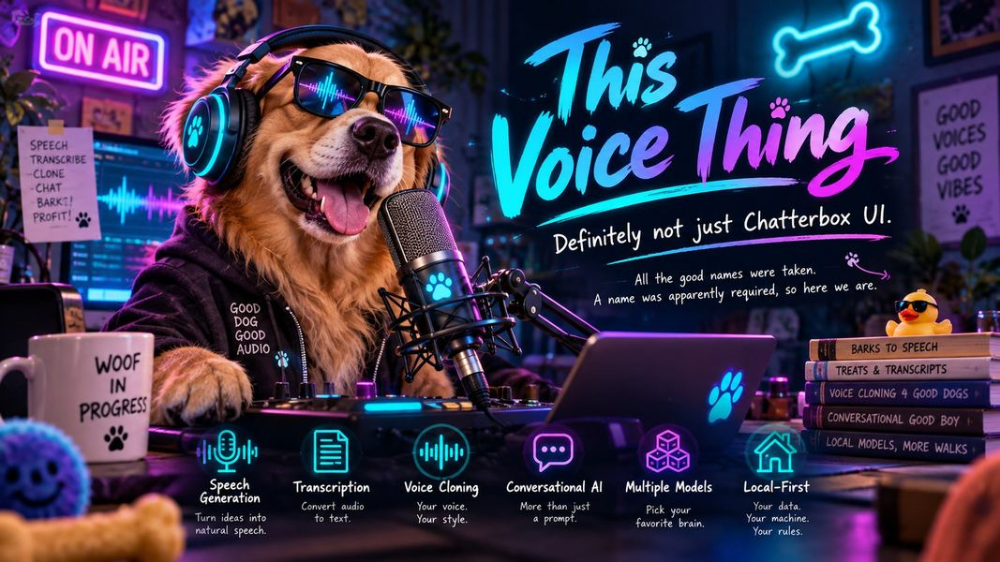

# This Voice Thing



> **Definitely not Chatterbox.**  
> **All the good names were taken.**  
> **A name was apparently required, so here we are.**

<!-- ALL-CONTRIBUTORS-BADGE:START - Do not remove or modify this section -->
[](#contributors-)
<!-- ALL-CONTRIBUTORS-BADGE:END -->

**This Voice Thing** is a Windows-first, local-first desktop app for working with voice AI models.

It started as a fork of [AcTePuKc/Chatterbox-TTS-UI](https://github.com/AcTePuKc/Chatterbox-TTS-UI), which itself provides a UI around Resemble AI's open-source [Chatterbox TTS](https://github.com/resemble-ai/chatterbox). Then we kept building things into it. And building. And building. At some point it stopped being particularly reasonable to keep calling the whole application “Chatterbox UI.”

So this is **This Voice Thing**.

You may also think of it as **Not Chatterbox**, **Name Required**, **Good Names Taken**, or **That Voice App We Apparently Had To Name**. Those are not separate editions. Naming software is simply a deeply unserious activity and we have chosen to stop pretending otherwise.

Underneath the stupid name is a fairly serious voice workbench: multiple local speech engines, voice cloning and design, preset voices, multi-speaker conversations, document narration, model discovery and management, a reusable voice library, pronunciation controls, subtitles, audio finishing tools, and a local API.

The application currently supports:

- **Chatterbox TTS** from Resemble AI
- **Qwen3-TTS** from Alibaba
- **VoxCPM2** from OpenBMB
- **OmniVoice** from k2-fsa
- **VibeVoice** from Microsoft Research
- **Kokoro** from hexgrad

Text, recordings, generated audio, saved voices and model configuration stay on your machine unless you explicitly use a feature that talks to an external service, such as Hugging Face discovery/downloads or Google Docs import.

> [!NOTE]
> The repository was renamed from `Knapp-Kevin/Chatterbox-TTS-UI` to `Knapp-Kevin/this-voice-thing`; GitHub redirects the old URLs, so existing clones keep working. The application is **This Voice Thing**; Chatterbox is one of the supported engines and the project this fork originally grew from. Runtime folders such as `chatterbox_outputs/` keep their names so existing files and scripts aren't stranded.

See [CHANGELOG.md](CHANGELOG.md) for the long version of how this got out of hand.

## Launchers

- `run.bat`: prepares or repairs the environment, then starts the app.
- `setup_env.bat`: runs setup by itself and writes installer logs to `logs/`.
- `run.sh` + `setup_env.sh`: best-effort macOS/Linux equivalents, not validated to the same level as Windows.

Windows remains the primary maintained path.

## Table of Contents

- [Screenshots](#screenshots)
- [How This Got Out of Hand](#how-this-got-out-of-hand)
- [Features](#features)
- [Local API](#local-api)
- [Google Docs sign-in setup](#google-docs-sign-in-setup)
- [Language Support](#language-support)
- [Prerequisites](#prerequisites)
- [Installation & Usage](#installation--usage)
- [Manual Installation](#manual-installation-advanced)
- [Project Structure](#project-structure)
- [Troubleshooting](#troubleshooting)
- [PyTorch & Reproducibility](#important-notes-on-pytorch-installation--reproducibility)
- [Contributing](#contributing)
- [Acknowledgements](#acknowledgements)

## Screenshots

| Generate (light) | Generate with Qwen3 preset voices (dark) |
| --- | --- |
|  |  |
| **Rendering a document** | **Voice** |
|  |  |
| **Model** | **Advanced** |
|  |  |
| **Recording a reference clip** | **Discover models on Hugging Face** |
|  |  |

## How This Got Out of Hand

The original Chatterbox UI remains the project's foundation and deserves explicit credit. This fork has simply grown far beyond being a UI for one model.

Current additions include:

- **Six speech engines grouped by capability.** Chatterbox, Qwen3-TTS, VoxCPM2, OmniVoice, VibeVoice and Kokoro can provide different combinations of cloning, preset voices, voice design and conversations.
- **Multi-speaker conversations.** VibeVoice can perform scripts with a different voice for each speaker.
- **Model-aware hardware guidance.** Model tiles show licensing, expected download size and GPU-memory requirements against the current machine.
- **In-app recording and voice management.** Record reference clips, import audio and save clip, preset and designed voices to a reusable library.
- **Document narration.** Open long text and documents, preview them, estimate generation time, render in sensible sections and keep partial work if generation is stopped.
- **Hugging Face model discovery.** Search compatible models, inspect basic compatibility and licensing, and add supported repositories without hand-editing configuration files.
- **Pronunciation controls and subtitles.** Maintain a pronunciation dictionary and generate SRT or WebVTT from the known generation timeline.
- **Audio finishing.** Adjust paragraph pauses, normalize volume, trim silence, change speed or pitch, and export WAV, FLAC or MP3.
- **A local HTTP API.** Use the same engines and voice library from other software through OpenAI-compatible or native endpoints.
- **A redesigned desktop interface.** Generate, Voice, Model, Advanced and Log pages with light and dark themes.

In other words, calling the whole thing “Chatterbox UI” eventually became less a name and more a historical anecdote.

## Features

### Generate

- Model switcher grouped into **Voice cloning**, **Preset voices**, **Voice design** and, where relevant, **Conversations**.
- Plain-language delivery controls with engine-specific settings.
- Variation/seed controls for repeatable takes where supported.
- Language selection based on the active model.
- Engine-specific controls for Qwen, VoxCPM, OmniVoice, VibeVoice and Kokoro.
- Built-in player with history, seeking and optional auto-play.

### Documents and long text

- Open `.txt`, `.md` and `.docx` files while keeping text editable.
- Open public or authenticated Google Docs.
- Live duration, section and character estimates.
- Preview approximately 3, 5 or 10 seconds before committing to a long render.
- Preserve a chosen take or designed voice across a full document.
- Progress and time-remaining estimates during long generation jobs.
- Stopping a render keeps completed sections in a `_partial` output.
- Paragraph-aware sectioning avoids splitting text in places a human reader would not naturally pause.

### Voice library

Saved voices can be searched and reused across compatible engines.

- **Clip voices:** recordings or imported audio plus transcript.
- **Preset voices:** built-in voices from engines such as Kokoro or Qwen.
- **Designed voices:** voices created from descriptions or engine-specific attributes.
- Record directly in the app with countdown, level monitoring, clipping/quiet warnings and read-aloud passages.
- Save generated/design voices as reusable clips where supported.

### Models

The Model page organizes engines by capability rather than pretending every speech model works the same way.

Each model tile can show:

- loaded/download state;
- license or usage restriction;
- approximate download size;
- expected GPU-memory requirement;
- whether the model fits the current machine;
- Hugging Face repository information when applicable.

**Discover on Hugging Face** searches for compatible repositories while filtering unsupported conversion formats. **+ Add repo…** lets you inspect a specific repository before downloading anything.

A Hugging Face read token can be stored locally for gated/private repositories and higher Hub limits.

### Engines

#### Chatterbox

Chatterbox remains the default and the project's direct ancestor. It provides multilingual speech and voice cloning and runs in the main application environment.

#### Qwen3-TTS

Supports preset voices, voice design and voice cloning. Qwen runs in its own engine environment because its dependency requirements conflict with Chatterbox. Long documents can use batched generation, and a designed voice can be carried through the rest of a document by cloning the first generated section.

#### VoxCPM2

Supports voice cloning and voice design with multilingual 48 kHz output. Cloning can be steered with style text, and designed voices can be stabilized across longer documents.

#### VibeVoice

Supports multi-speaker conversational generation. Scripts use named turns such as `Linda: ...` and `Thomas: ...`, with a cast of sample or user-provided voices. Review Microsoft's model card and usage guidance before use.

#### OmniVoice

Supports fast multilingual voice cloning and attribute-based voice design. The currently supported pretrained weights are non-commercial; review the model license before use.

#### Kokoro

A small, fast preset-voice engine with multiple languages and low hardware requirements. Kokoro does not clone voices or accept free-form style instructions.

### Finishing touches and Advanced

- Paragraph pause control.
- Volume leveling.
- Start/end silence trimming.
- WAV, FLAC and optional MP3 output.
- Speed and pitch adjustment.
- SRT and WebVTT subtitles.
- Pronunciation dictionary with import/export and auditioning.
- Optional watermarking where supported.

## Local API

Other programs on the same PC can use the app's models and voices. Enable it under **Advanced → Local API**.

The server listens only on `127.0.0.1` by default (port `8765`) and can require a bearer token.

Requests use the same generation pipeline as the desktop UI: model selection, sectioning, batching, voice handling, pronunciation and finishing options.

### OpenAI-compatible speech endpoint

```bash
curl http://127.0.0.1:8765/v1/audio/speech \
  -H "Content-Type: application/json" \
  -d '{"input":"Hello from my own computer.","voice":"alloy","response_format":"mp3"}' \
  -o speech.mp3
```

### Native endpoint

```bash
curl http://127.0.0.1:8765/v1/speech \
  -H "Content-Type: application/json" \
  -d '{"text":"Chapter one...","model":"Kokoro voices","voice":"george","subtitles":"srt","format":"flac","name":"chapter1"}'
```

Discovery endpoints include:

- `GET /v1/health`
- `GET /v1/models`
- `GET /v1/voices`

## Google Docs sign-in setup

Shared Google Doc links work without authentication. Opening private Docs requires a Google OAuth desktop client:

1. Create a project in [Google Cloud Console](https://console.cloud.google.com/).
2. Enable the **Google Drive API**.
3. Configure the Google Auth Platform branding/audience and add your account as a test user if the app remains in testing.
4. Create a **Desktop app** OAuth client and download its JSON file.
5. In This Voice Thing, choose **Open... → From Google Docs... → Set up...**, select that JSON file, then sign in.

The app requests read-only Drive access. Local auth information is stored in `google_auth.json`.

## Language Support

Language support depends on the active engine/model:

- **Chatterbox multilingual:** Arabic, Danish, German, Greek, English, Spanish, Finnish, French, Hebrew, Hindi, Italian, Japanese, Korean, Malay, Dutch, Norwegian, Polish, Portuguese, Russian, Swedish, Swahili, Turkish and Chinese.
- **Qwen3-TTS:** English, Chinese, Japanese, Korean, German, French, Russian, Portuguese, Spanish and Italian.
- **VibeVoice:** English and Chinese.
- **OmniVoice:** 600+ languages.
- **Kokoro:** US/UK English, Spanish, French, Hindi, Italian, Brazilian Portuguese and Mandarin.
- **VoxCPM2:** 30 languages plus several Chinese dialects.

Community fine-tunes may add other languages. Use **Check** before assuming a Hugging Face repository is compatible.

## Prerequisites

1. **Python 3.11** for the maintained Windows launcher path.
2. **`uv`** for Python environment/package management: <https://github.com/astral-sh/uv#installation>
3. **NVIDIA GPU recommended.** CPU operation is possible for some engines but may be considerably slower.
4. **FFmpeg recommended** for high-quality speed/pitch processing and related export features.
5. **Disk space:** allow substantial room for PyTorch environments and model weights. Individual engines/models can consume several gigabytes each.
6. **Internet access** for initial setup and model downloads. Local generation can run offline afterward for installed models.

Approximate GPU guidance varies by model, but as a rough starting point:

| Engine/model | Approximate VRAM guidance |
| --- | --- |
| Kokoro | ~2 GB |
| OmniVoice | 3–4 GB |
| Chatterbox | 4 GB minimum, ~6 GB comfortable |
| VoxCPM2 | ~6 GB minimum, ~8 GB comfortable |
| VibeVoice 1.5B | ~8 GB minimum, ~10 GB comfortable |
| Qwen3 0.6B | ~4 GB minimum |
| Qwen3 1.7B | ~6 GB minimum, more for full batching |

The Model page provides more relevant guidance against the current machine.

## Installation & Usage

1. Clone or download this repository:

   ```bash
   git clone https://github.com/Knapp-Kevin/this-voice-thing
   cd this-voice-thing
   ```

2. On Windows, double-click `run.bat`.

   It will create/repair `.venv`, install locked dependencies, install an appropriate PyTorch runtime when needed, and start the app.

3. Generate speech from the **Generate** page.
4. Record or import voices from the **Voice** page.
5. Install/switch engines from the **Model** page.
6. Add compatible Hugging Face models through **Discover** or **+ Add repo…**.

Installer decisions are written to `logs/installer_*.log`; startup crashes are written to `logs/app_startup_*.log`.

## Manual Installation (Advanced)

`run.sh` and `setup_env.sh` mirror the launcher pattern for macOS/Linux but remain best-effort. Manual setup is the safer fallback outside Windows.

```bash
uv venv .venv --python 3.11
```

Activate the environment:

```bash
# Windows
.\.venv\Scripts\activate

# macOS/Linux
source .venv/bin/activate
```

Then:

```bash
uv pip sync requirements.lock.txt
python scripts/install_torch.py
python main.py
```

Optional engines install into their own `engines/<name>/.venv` environments from inside the app. Do not casually merge their Python dependencies into the main environment; several require mutually incompatible library versions, because dependency resolution apparently needed its own contribution to the comedy.

## Project Structure

```
this-voice-thing/
├─ main.py                      start here: `python main.py` (run.bat / run.sh call it)
├─ run.bat, setup_env.bat       Windows launcher and setup (maintained)
├─ run.sh, setup_env.sh         macOS/Linux launcher and setup (best effort)
├─ this_voice_thing/            the application package
│  ├─ app.py                    start-up wrapper and crash logging
│  ├─ paths.py                  where code and data live
│  ├─ ui/
│  │  ├─ main_window.py         the window, pages, dialogs and generation thread
│  │  ├─ theme.py               light/dark theme and its semantic colour tokens
│  │  └─ tiles.py               model and voice tiles
│  ├─ engines/
│  │  ├─ chatterbox_backend.py  Chatterbox, loaded in-process
│  │  ├─ worker.py              shared worker/environment support for the other engines
│  │  └─ qwen.py, kokoro.py, voxcpm.py, omnivoice.py, vibevoice.py
│  ├─ core/
│  │  ├─ model_registry.py      engines, capabilities, licenses, hardware needs, Hugging Face discovery
│  │  ├─ documents.py           document loading, sectioning, conversation scripts
│  │  ├─ audio_effects.py       joining, finishing, speed/pitch, export
│  │  ├─ subtitles.py           SRT/WebVTT from the render timeline
│  │  ├─ pronunciation.py       pronunciation dictionary
│  │  └─ voice_library.py       saved clip, preset and designed voices
│  └─ integrations/
│     ├─ local_api.py           local OpenAI-compatible and native HTTP API
│     └─ google_docs.py         Google Docs import and sign-in
├─ engines/<name>/              engine worker scripts, plus their own .venv once installed
├─ scripts/install_torch.py     picks a PyTorch build for your hardware (run by setup)
├─ tests/                       automated tests (`python -m unittest discover tests`)
├─ assets/                      icons and branding (assets/branding/)
├─ docs/screenshots/            README screenshots
├─ models.json                  the model list
└─ requirements.in, requirements.lock.txt, uv.toml
```

Your data stays in the project folder, where it has always been: `app_settings.json`, `models.json`, `chatterbox_outputs/`, `reference_recordings/`, `voice_library/`, `pronunciations.json`, `google_auth.json`, `logs/`, `.venv/` and each engine's `engines/<name>/.venv/`. Those names are kept for compatibility even though the app is now This Voice Thing.

## Troubleshooting

A few common failures:

- **First launch appears stuck:** model and PyTorch downloads can take time. Check the Log page and `logs/`.
- **NVIDIA GPU exists but CPU is selected:** verify `nvidia-smi`, delete `.venv\.torch_checked`, then rerun `run.bat`.
- **Broken environment:** delete `.venv` and let the launcher rebuild it.
- **macOS/Linux launcher failure:** use the manual installation flow; shell support is still best-effort.
- **Window never appears:** inspect the newest `logs/app_startup_*.log`.
- **Microphone unavailable:** verify the device and Windows desktop-app microphone permissions.
- **Custom Hugging Face repo fails:** run **Check** in the model editor before downloading. GGUF, ONNX, MLX and partial fine-tunes are not necessarily drop-in compatible.
- **Unauthenticated Hugging Face warning:** optional. Add a read token on the Model page if needed.

## Important Notes on PyTorch Installation & Reproducibility

The project uses two deliberately separate mechanisms:

1. `requirements.lock.txt` keeps the main application's Python dependencies pinned.
2. `scripts/install_torch.py` selects a PyTorch runtime appropriate for the machine instead of pretending one wheel can sensibly serve every NVIDIA generation and CPU-only installation.

Optional engines use isolated environments where their dependencies conflict with the main application or each other. This costs disk space but avoids turning the primary environment into dependency soup.

## Contributing

Issues and pull requests are welcome for application behavior, installer reliability, UI/UX, model compatibility, documentation and additional engines. See [CONTRIBUTING.md](CONTRIBUTING.md).

Please keep model licensing, attribution, local/private behavior and compatibility claims accurate. The project name may be unserious. Those parts are not.

## Acknowledgements

**This Voice Thing is based on Chatterbox-TTS-UI.** The rename does not erase the project's lineage, upstream work or licenses.

- **AcTePuKc** for the original [Chatterbox-TTS-UI](https://github.com/AcTePuKc/Chatterbox-TTS-UI) this fork builds on (MIT).
- **Resemble AI** for [Chatterbox TTS](https://github.com/resemble-ai/chatterbox) (MIT).
- **Alibaba / the Qwen team** for [Qwen3-TTS](https://github.com/QwenLM/Qwen3-TTS) (Apache-2.0).
- **OpenBMB** for [VoxCPM](https://github.com/OpenBMB/VoxCPM) (Apache-2.0).
- **Microsoft Research** for [VibeVoice](https://github.com/microsoft/VibeVoice) and its associated research/model work.
- **k2-fsa / Xiaomi** for [OmniVoice](https://github.com/k2-fsa/OmniVoice) (code Apache-2.0; review the model weights' separate license).
- **hexgrad** for [Kokoro](https://huggingface.co/hexgrad/Kokoro-82M) and its [misaki](https://github.com/hexgrad/misaki) text front end (Apache-2.0).
- The developers and maintainers of PySide6, NLTK, PyTorch, librosa, FFmpeg, Rubber Band, `uv`, and the rest of the stack that makes this ridiculous thing work.

## Contributors ✨

Thanks goes to these wonderful people:

<!-- ALL-CONTRIBUTORS-LIST:START - Do not remove or modify this section -->
<!-- prettier-ignore-start -->
<!-- markdownlint-disable -->
<table>
  <tbody>
    <tr>
      <td align="center" valign="top" width="14.28%"><a href="https://github.com/lowkeytea"><br /><sub><b>lowkeytea</b></sub></a><br /><a href="https://github.com/actepukc/Chatterbox-TTS-UI/commits?author=lowkeytea" title="Code">💻</a></td>
    </tr>
  </tbody>
</table>

<!-- markdownlint-restore -->
<!-- prettier-ignore-end -->
<!-- ALL-CONTRIBUTORS-LIST:END -->

This project follows the [all-contributors](https://github.com/all-contributors/all-contributors) specification. Contributions of any kind welcome!
