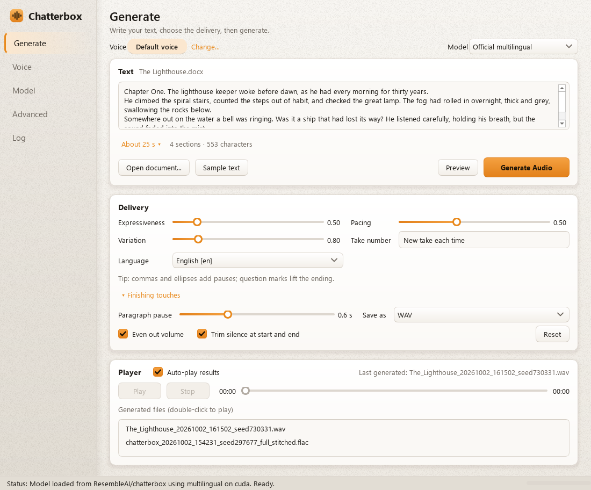
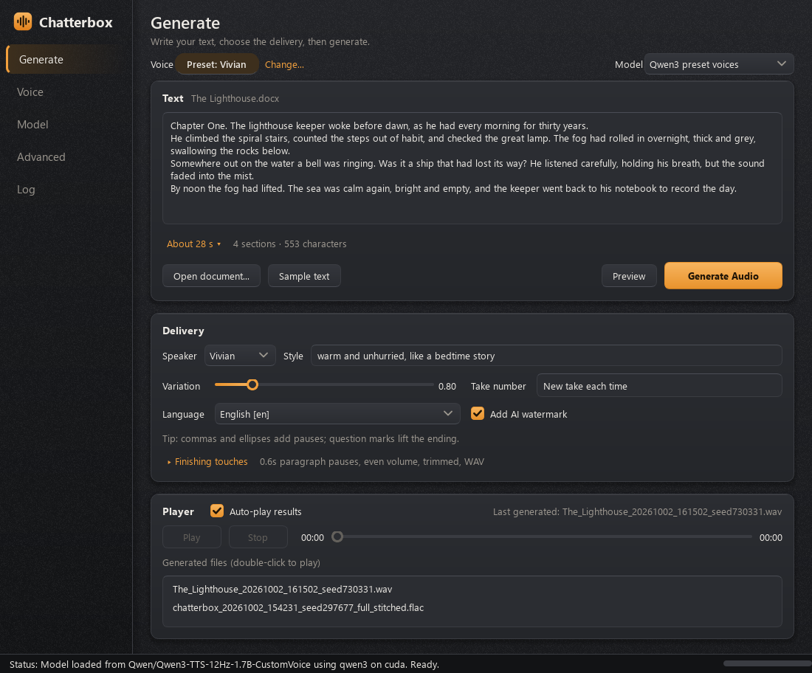
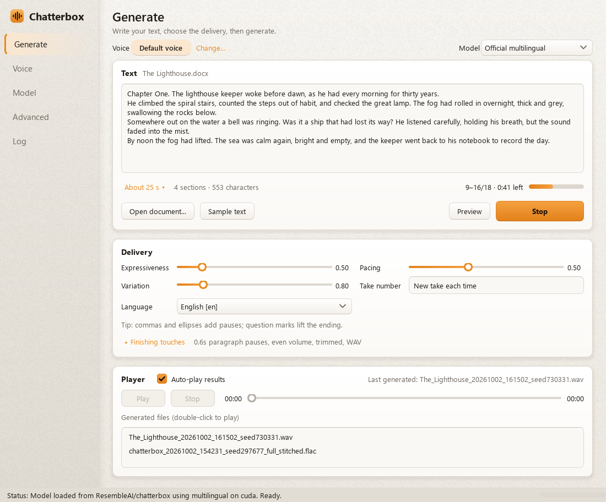
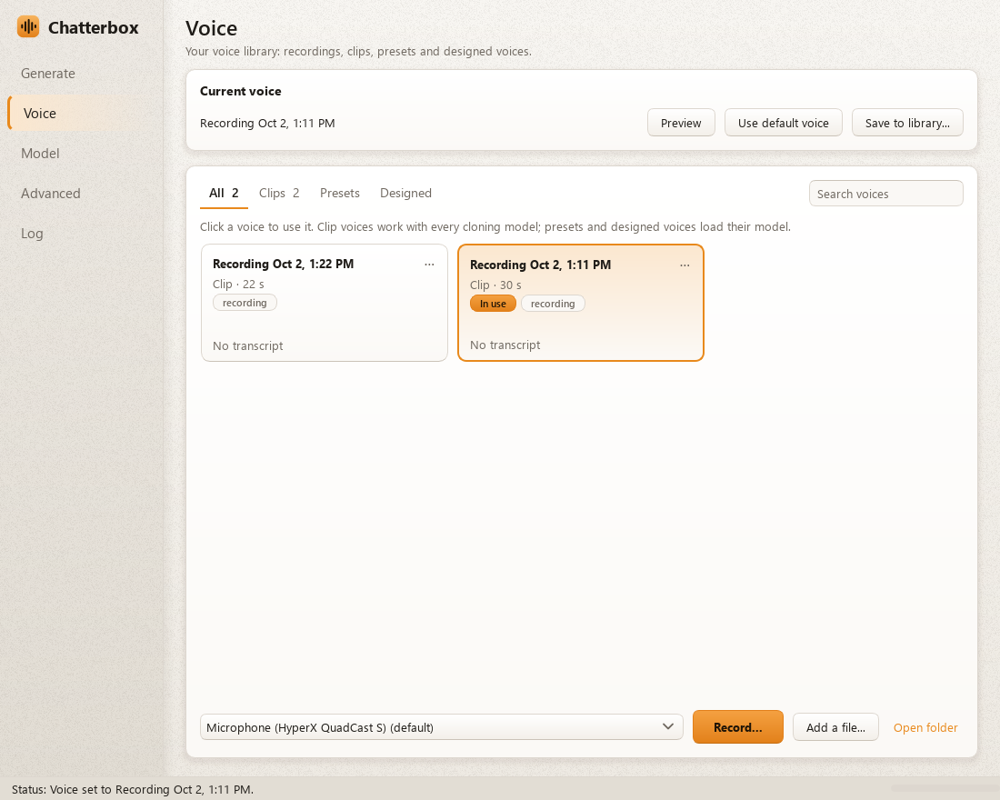
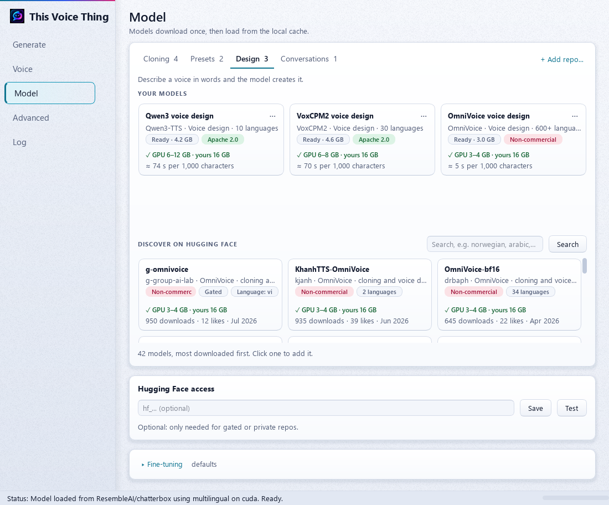
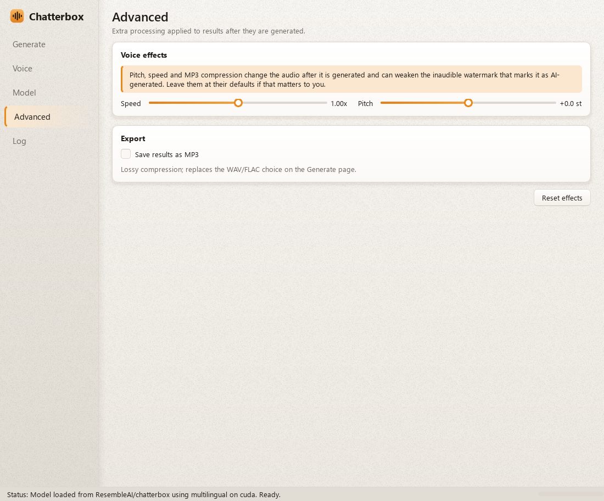
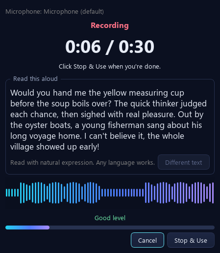
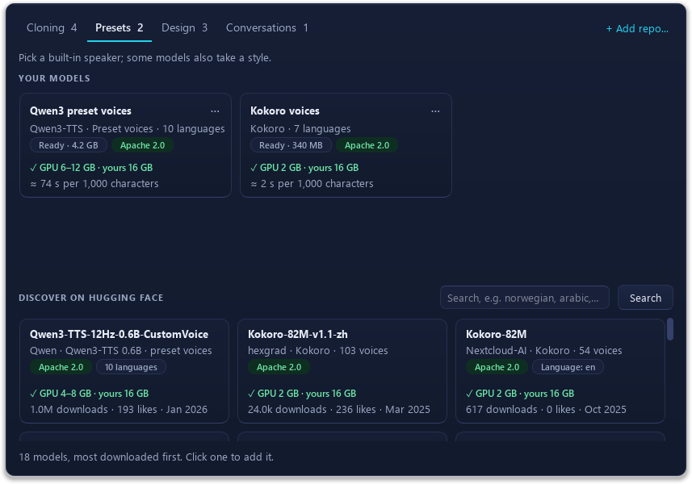

# Chatterbox TTS - One Click Installer & UI
<!-- ALL-CONTRIBUTORS-BADGE:START - Do not remove or modify this section -->
[](#contributors-)
<!-- ALL-CONTRIBUTORS-BADGE:END -->

A Windows-first desktop app for local, private text-to-speech and voice cloning. It runs Resemble AI's open-source **Chatterbox TTS** and, optionally, Alibaba's **Qwen3-TTS**, OpenBMB's **VoxCPM2**, k2-fsa's **OmniVoice**, Microsoft's **VibeVoice** and hexgrad's **Kokoro** on your own GPU. Text, recordings and generated audio never leave your machine.

This fork of [AcTePuKc/Chatterbox-TTS-UI](https://github.com/AcTePuKc/Chatterbox-TTS-UI) adds a redesigned interface, in-app voice recording, document narration, a second TTS engine and in-app model management. See [CHANGELOG.md](CHANGELOG.md) for everything that changed.

Launchers:

*   `run.bat`: prepares or repairs the environment, then starts the app.
*   `setup_env.bat`: the setup step on its own; writes installer logs to `logs/`.
*   `run.sh` + `setup_env.sh`: best-effort macOS/Linux equivalents, not validated to the same level as Windows.

Windows remains the primary maintained path.


## Table of Contents

* [Screenshots](#screenshots)
* [What's New in This Fork](#whats-new-in-this-fork)
* [Features](#features)
* [Language Support](#language-support)
* [Prerequisites](#prerequisites)
* [Installation & Usage](#installation--usage)
* [Manual Installation (Advanced)](#manual-installation-advanced)
* [Project Structure](#project-structure)
* [Troubleshooting](#troubleshooting)
* [Important Notes on PyTorch Installation](#important-notes-on-pytorch-installation--reproducibility)
* [Contributing](#contributing)
* [Acknowledgements](#acknowledgements)

## Screenshots

| Generate (light) | Generate with Qwen3 preset voices (dark) |
| --- | --- |
|  |  |
| **Rendering a document** | **Voice** |
|  |  |
| **Model** | **Advanced** |
|  |  |
| **Recording a reference clip** | **Discover models on Hugging Face** |
|  |  |

## What's New in This Fork

*   **Six engines, grouped by what they do.** Chatterbox (23 languages, voice cloning), plus optional Qwen3-TTS (preset voices with style instructions, voice design from a written description, and voice cloning), VoxCPM2 (cloning with a style, and voice design, in 30 languages at 48 kHz), OmniVoice (fast cloning and voice design in 600+ languages, non-commercial), VibeVoice (conversations with up to 4 speakers, research use) and Kokoro (dozens of preset voices, very fast).
*   **Conversations.** Write a script like `Linda: …` / `Thomas: …` and VibeVoice performs it with a different voice for each speaker.
*   **Know before you download.** Every model tile shows its license and the GPU memory it needs, compared with your own GPU.
*   **Record your own voice in the app.** A guided recording window: countdown, live level meter, too-quiet and clipping warnings, and a phonetically rich passage to read.
*   **Narrate whole documents.** Open `.txt`, `.md` or `.docx`, preview a sample first, see a time estimate for every model, and follow progress with time remaining. Sections are split where a reader would pause, never mid-phrase or across paragraphs.
*   **Manage models without editing files.** Browse compatible Hugging Face models by what they do, see each one's license at a glance, check a repo before downloading it, and add, edit or hide models from the Model page.
*   **A calmer, clearer interface.** Sidebar pages, plain-language controls, and a light/dark theme that follows Windows. The window sizes itself so nothing ever needs scrolling.

## Features

<details>
<summary>Click to expand</summary>

### Generate

*   **Model switcher**, grouped into *Voice cloning*, *Preset voices* and *Voice design*. Switching loads the model.
*   **Delivery controls in plain language:**
    *   **Expressiveness** (exaggeration) and **Pacing** (CFG weight), for Chatterbox models.
    *   **Variation** (temperature) and **Take number** (seed): "New take each time", or a fixed number to reproduce a take exactly.
    *   **Language**, based on what the selected model supports.
    *   Hover any control for an explanation. The original parameter name is shown in brackets.
*   **Qwen, VoxCPM, OmniVoice, VibeVoice and Kokoro controls** replace Expressiveness and Pacing when one of their models is active:
    *   **Speaker** and **Style** for Qwen preset voices.
    *   **Voice** for Kokoro, listing the voices for the selected **Language**. Your choice is remembered per language.
    *   **Voice description** for voice design.
    *   **Clip transcript** for cloning, plus an optional **Style** with VoxCPM2. The transcript must match what's said in the clip. OmniVoice requires it.
    *   **Voice attributes** for OmniVoice voice design, with an **Attributes…** picker.
    *   **Speakers** and **Cast…** for VibeVoice conversations.
    *   **Add AI watermark**, on by default.
*   **Player** with play/pause, stop and seeking, a history of generated files, and optional auto-play.

### Documents and long text

*   **Open document...** loads `.txt` (UTF-8, UTF-16 or Windows-1252), `.md` (formatting stripped) or `.docx`. Text stays editable.
*   **A live summary** under the text, for example "About 1 min 40 s · 4 sections · 553 characters". It updates as you edit, even during a render. Click the estimate to compare every model's time for the current text and switch to one.
*   **Estimates are learned per model** from your own runs, so they get more accurate with use.
*   **Preview** generates your selection, or the opening section, so you can check the voice and settings first. **Keep this take** locks the preview's take number, so the full render matches.
*   **Progress** shows the sections being generated and the time remaining, for example "9–16/18 · 0:41 left".
*   **Stop keeps your work.** Finished sections are saved as a `_partial` file.
*   **Output files** are named after the document.

**How text is split:** models generate long text in sections, and intonation can reset where sections join. So sections are placed where a reader would pause anyway:

*   **Never across paragraphs or headings.** A short line without closing punctuation, like "Chapter Two", is read as a heading.
*   **Overlong sentences** split at a clause break (; : — or a comma near the middle). A word boundary is used only when there's no punctuation.
*   **Section size depends on the engine.** Chatterbox uses up to 280 characters per section, Kokoro and VoxCPM 400, and Qwen 600, so most paragraphs are generated in one piece.
*   **Pauses depend on the type of join.** Each section's own leading and trailing silence is trimmed, then a consistent gap is added: short inside a sentence, a little longer between sentences, your **Paragraph pause** between paragraphs, and a bit more after headings.

### Voice

*   **Current voice**, with **Preview** and **Use default voice**.
*   **Record...** opens a guided recording window:
    *   A 3-second countdown. The level meter works during the countdown as a mic check.
    *   An elapsed/maximum timer and a scrolling level graph.
    *   "Good level", "Too quiet" and "Too loud – clipping" hints.
    *   **Stop & Use** is available after 3 seconds, and recording stops automatically at 30 seconds.
    *   **Read-aloud passages** cover every English vowel and consonant sound and include a question and an exclamation for inflection.
    *   Recordings are saved to `reference_recordings/` together with the passage that was read. Qwen voice cloning uses that text as the clip transcript.
*   **Saved recordings and files**, each showing its length and date. Use or preview any of them, or browse for a `.wav`, `.mp3` or `.flac`.

### Model

*   **Tabs by capability:** **Cloning**, **Presets**, **Design** and **Conversations**.
*   **Your models** as tiles: name, engine, languages and the typical time for 1,000 characters (learned from your own runs). Each tile shows:
    *   **Status:** Loaded, Ready (with its cached size), Download (with its size), or Needs engine.
    *   **License:** green for permissive licenses such as MIT or Apache 2.0, red for non-commercial, amber when unclear. Fine-tunes inherit a non-commercial base model's license even when their own tag says otherwise. Always read the model card before commercial use.
    *   **GPU memory needed, compared with yours:** green ✓ when it fits, amber ! when it runs but slower (for example smaller Qwen batches), red ✗ when your GPU is too small. Hover for details, including whether the model can fall back to the CPU.
*   **Your list is what you've chosen, not what's downloaded.** The app ships with the official Chatterbox model, the three Qwen3 models and Kokoro. Each downloads the first time you load it, and its tile shows the size first.
*   **Click a tile to load it.** Right-click or **⋯** for **Edit…**, **Duplicate…**, **Hide from model switcher**, **Open on Hugging Face** and **Remove…**. Removing a model keeps its downloaded files.
*   **Discover on Hugging Face** lists models this app can load for the current tab, most downloaded first, skipping ones you already have. Discover tiles show the same license and GPU lines. Search by name or language. MLX, GGUF, ONNX, OpenVINO and Core ML conversions are filtered out. Click a tile to add it; nothing downloads until you load it.
*   **+ Add repo…**: enter a Hugging Face repo and click **Check**. Before anything downloads, it confirms the repo exists, which engine can load it, its license, its download size, and whether it's public, gated or private. Saving writes `models.json` for you.
*   **Hugging Face access:** a token field with **Save** and **Test**. The token is stored only in `app_settings.json` on your computer, never in `models.json`. It's only needed for gated or private repos, or for higher download limits.
*   **Fine-tuning:** repetition control, the unlikely-sound filter (min-p) and top-p. Remembered between sessions.

### Finishing touches and Advanced

*   **Finishing touches** (Generate page, lossless): paragraph pause, even out volume, trim silence at the start and end, and save as WAV or FLAC.
*   **Advanced page:** **Speed** and **Pitch** (FFmpeg's Rubber Band with formant preservation when available, librosa otherwise), and **Save results as MP3**. A note explains that these can weaken the inaudible AI watermark, and the Finishing touches summary flags them while they're active.

### Qwen3-TTS engine (optional)

*   Three Apache-2.0 models: **Qwen3 preset voices** (9 built-in speakers), **Qwen3 voice design** and **Qwen3 voice cloning**. Each is about 4.2 GB, and they cover 10 languages.
*   Qwen needs different library versions than Chatterbox (`transformers` 4.57 vs 5.2). It runs in its own environment (`engines/qwen/.venv`) as a background worker. The first time you load a Qwen model, the app offers to install it.
*   **Batched generation.** Several sections go to the GPU in one call: up to 16 sections or about 5,000 characters, whichever comes first. On an RTX 5070 Ti, an 18-section document took about 1 min 50 s, against about 10 minutes one section at a time. A batch that doesn't fit in GPU memory is split automatically.
*   **Optional watermark.** Qwen output can get the same inaudible Perth AI watermark that Chatterbox applies.

### VoxCPM2 engine (optional)

*   **One model, two uses** (`openbmb/VoxCPM2`, Apache-2.0, about 5 GB): **VoxCPM2 voice cloning** and **VoxCPM2 voice design** share the same download. Once either is loaded, switching to the other is instant.
*   **Cloning** uses the clip from the Voice page. Add a **Style** (for example "slightly faster, cheerful tone") to steer delivery while keeping the voice. Add a **Clip transcript** for a closer match.
*   **Voice design** creates a voice from a **Voice description**. A designed voice is invented afresh on every call, so the first section of a document becomes the reference for the rest, and one voice carries through.
*   **30 languages**, detected from the text, and **48 kHz** output.
*   On an RTX 5070 Ti it runs at about real time (roughly 70 s per 1,000 characters) and peaks around 5.9 GB of GPU memory.
*   It runs in its own environment (`engines/voxcpm/.venv`, about 1.5 GB of packages plus PyTorch). The first time you load it, the app offers to install it.
*   Older VoxCPM models (0.5B, 1.5) also load. They clone only with a clip transcript, and can't take a style or design voices.

### VibeVoice engine (optional, research use)

*   **License:** VibeVoice is MIT-licensed, but Microsoft's model card limits it to research use and recommends against commercial use. It also rules out cloning anyone's voice without their recorded consent, and passing audio off as genuine recordings. Its tiles carry an amber **Research use** badge instead of a green MIT one.
*   **Conversations** (`vibevoice/VibeVoice-1.5B-hf`, about 5 GB). Write the script one speaker per line, for example `Linda: Welcome back to the show.` / `Thomas: Thanks for having me.` Lines without a name continue the previous speaker's turn. Up to 4 speakers.
*   **Cast…** picks a voice for each speaker. Choose from 7 sample voices that ship with VibeVoice, your recordings, or any clip. Speakers you haven't cast get distinct sample voices automatically. The cast summary next to the button follows the script as you type.
*   **Long scripts** are split only between whole turns (about 1,500 characters per section), so no one is cut off mid-sentence. Each speaker keeps the same voice across sections.
*   **Speed:** on an RTX 5070 Ti, a four-turn, 1,300-character script (65 s of conversation) took about 2 min 20 s. GPU memory peaks around 6–7 GB on the 1.5B model. The 7B conversion needs a 24 GB GPU.
*   It runs in its own environment (`engines/vibevoice/.venv`, with a newer `transformers` than Chatterbox). The first time you load it, the app offers to install it.

### OmniVoice engine (optional, non-commercial)

*   **License:** OmniVoice's code is Apache-2.0, but its pre-trained weights (`k2-fsa/OmniVoice`) are **CC BY-NC 4.0** because of their training data. Use it for personal and non-commercial work only. Its tiles carry a red **Non-commercial** badge, and so do community fine-tunes, whatever their own tag says.
*   **One model, two uses** (about 3 GB): **OmniVoice voice cloning** and **OmniVoice voice design**. Once either is loaded, switching to the other is instant.
*   **Cloning needs the Clip transcript.** Without one, OmniVoice would download a separate speech-recognition model, so the app asks for the transcript instead. Recordings made with **Record…** fill it in.
*   **Voice design uses fixed attributes**, not free text: gender, age (child to elderly), pitch (very low to very high), whisper, and an English accent or Chinese dialect. Use **Attributes…** to pick them. Anything else is caught before generating. As with VoxCPM, the first section of a document becomes the reference for the rest, so one voice carries through.
*   **600+ languages.** Pick one in **Language**, or leave **Detect automatically**.
*   **Very fast and light.** Sections are batched (8 per call). On an RTX 5070 Ti, four paragraphs took about 3 s, and GPU memory peaks around 2–3.5 GB.
*   It runs in its own environment (`engines/omnivoice/.venv`). The first time you load it, the app offers to install it.

### Kokoro engine (optional)

*   **Kokoro voices** (`hexgrad/Kokoro-82M`, Apache-2.0): 49 built-in voices in US and UK English, Spanish, French, Hindi, Italian, Brazilian Portuguese and Mandarin. The model is about 340 MB and needs about 2 GB of GPU memory. It also runs on a CPU.
*   **Very fast.** On an RTX 5070 Ti, two paragraphs (25 s of speech) took about 2 s, roughly 20× faster than Chatterbox.
*   **Preset voices only.** Kokoro doesn't clone voices or take style instructions. Pick a **Language**, then a **Voice**.
*   Its text processing (misaki, spaCy, espeak-ng) runs in its own environment (`engines/kokoro/.venv`). The first time you load Kokoro, the app offers to install it.
*   **Optional watermark,** as with Qwen.
*   Community Kokoro repos with voices in other languages (for example German) are hidden from Discover, because Kokoro's text pipeline can't speak them here.

### Interface

*   **Sidebar pages:** Generate, Voice, Model, Advanced and Log.
*   **Light and dark themes** with an amber accent, following the Windows app mode and switching live.
*   **No scrolling needed.** The window opens at a comfortable size within your screen, never shrinks below what its content needs, and stretches the text and lists when enlarged.
*   **Log page:** model downloads, warnings and errors.

### Windows setup (`run.bat` + `setup_env.bat`)

*   Uses `uv` to create `.venv` and install the locked dependencies from `requirements.lock.txt`.
*   Detects your NVIDIA driver's CUDA version and installs a matching PyTorch build: CUDA 12.8 wheels for RTX 50-series cards, otherwise the best match, falling back to CPU.
*   Writes timestamped installer logs to `logs/`. Later launches skip work that's already done.

</details>

## Language Support

<details>
<summary><strong>Supported languages by engine</strong> - Click to Expand</summary>

*   **Chatterbox multilingual** (`ResembleAI/chatterbox`, the default): `ar`, `da`, `de`, `el`, `en`, `es`, `fi`, `fr`, `he`, `hi`, `it`, `ja`, `ko`, `ms`, `nl`, `no`, `pl`, `pt`, `ru`, `sv`, `sw`, `tr`, `zh`.
*   **Chatterbox original (single language):** the older layout. It speaks English with the official weights, or the language a community fine-tune was trained on (for example Norwegian or Indonesian).
*   **Qwen3-TTS:** `en`, `zh`, `ja`, `ko`, `de`, `fr`, `ru`, `pt`, `es`, `it`.
*   **VibeVoice:** English and Chinese.
*   **OmniVoice:** 600+ languages. The Language box lists about 60 common ones plus **Detect automatically**.
*   **Kokoro:** `en` (US and UK voices), `es`, `fr`, `hi`, `it`, `pt` (Brazilian), `zh`.
*   **VoxCPM2:** 30 languages, detected from the text: `ar`, `my`, `zh`, `da`, `nl`, `en`, `fi`, `fr`, `de`, `el`, `he`, `hi`, `id`, `it`, `ja`, `km`, `ko`, `lo`, `ms`, `no`, `pl`, `pt`, `ru`, `es`, `sw`, `sv`, `tl`, `th`, `tr`, `vi`, plus several Chinese dialects.
*   **Bulgarian** isn't in the official Chatterbox language list.
*   Use **Discover** on the Model page (search a language name) to look for community fine-tunes in other languages. Not every Hugging Face repo is loadable; **Check** tells you before anything downloads.
</details>

## Prerequisites

<details>
<summary>Click to expand</summary>

1.  **Python 3.11**, the supported target for the Windows launcher.
2.  **`uv`**, a fast Python package manager: [https://github.com/astral-sh/uv#installation](https://github.com/astral-sh/uv#installation)
3.  **NVIDIA GPU (recommended):** install the current NVIDIA driver. The installer reads the driver's CUDA version to pick a PyTorch build. Without a GPU, the app runs on CPU, more slowly. GPU memory each model needs (also shown on its tile):
    *   **Kokoro:** about 2 GB. Also usable on a CPU.
    *   **OmniVoice:** 3 GB minimum, 4 GB for full batches. Peaks around 2.1 GB for one section.
    *   **Chatterbox:** at least 4 GB; 6 GB is comfortable. Peaks around 3.2 GB while generating. Works on a CPU, about 8× slower.
    *   **VoxCPM2:** 6 GB minimum, 8 GB comfortable. Peaks around 5.9 GB.
    *   **VibeVoice 1.5B:** 8 GB minimum, 10 GB comfortable. The 7B conversion needs about 20–24 GB.
    *   **Qwen3 0.6B models:** 4 GB minimum, 8 GB for full-speed batches.
    *   **Qwen3 1.7B models:** 6 GB minimum, 12 GB for full-speed batches (long documents peak near 10 GB). Very slow on a CPU.
4.  **FFmpeg (optional, recommended):** used for high-quality speed and pitch changes on the Advanced page. Playback doesn't need it. Install it, for example with `winget install Gyan.FFmpeg.Essentials`, or from [https://ffmpeg.org/download.html](https://ffmpeg.org/download.html), and make sure `ffmpeg.exe` is on your PATH.
5.  **Disk space:** about 12 GB for the app environment (mostly PyTorch) and the default Chatterbox model. The optional Qwen, VoxCPM, OmniVoice, VibeVoice and Kokoro engines each need up to about 8 GB more for their environments (much less when `uv` can share PyTorch files), plus about 4.2 GB per Qwen model, 5 GB for VoxCPM2, 3 GB for OmniVoice, 5 GB for VibeVoice 1.5B and 340 MB for Kokoro.
6.  **Internet connection** for the first setup and model downloads. After that, generation runs offline with both engines.
</details>

## Installation & Usage

<details>
<summary>Click to expand</summary>

1.  **Clone or download this repository:**
    ```bash
    git clone https://github.com/Knapp-Kevin/Chatterbox-TTS-UI
    cd Chatterbox-TTS-UI
    ```
    Or download the ZIP and extract it.
2.  **Run the launcher:** double-click `run.bat`. It:
    *   Runs `setup_env.bat` to create or repair `.venv`.
    *   Installs the locked dependencies.
    *   Runs `install_torch.py` when the PyTorch runtime needs installing or repairing.
    *   Starts the app.

    The first launch can take several minutes while PyTorch and the default model (about 3 GB) download. Installer decisions are logged to `logs\installer_*.log`, and startup crashes to `logs\app_startup_*.log`. Later launches start in seconds.
3.  **Generate speech:**
    *   Type or paste text, or click **Open document...**.
    *   Optionally click **Preview** to hear a sample, then **Keep this take** if you like it.
    *   Click **Generate Audio**. Results are saved to `chatterbox_outputs/` and listed under the player.
4.  **Clone a voice:** on the **Voice** page, pick a microphone and click **Record...**, or **Browse for a file...**. The selected clip is used by the Voice cloning models.
    *   Chatterbox relies mostly on the first 6–10 seconds of a clip, so start speaking right away and keep the room quiet.
5.  **Try another engine (optional):** pick a Qwen3, VoxCPM2, OmniVoice, VibeVoice or Kokoro model in the model switcher, or click its tile on the Model page. The first time, the app offers to install that engine. Each model downloads the first time you use it.
6.  **Add more models:** on the **Model** page, click a tile under **Discover**, or use **+ Add repo…** with **Check**.
7.  **Hugging Face token (optional):** create a token with `Read` access at [Hugging Face Settings > Access Tokens](https://huggingface.co/settings/tokens). Paste it under **Hugging Face access** on the Model page, then click **Save** and **Test**. It's only needed for gated or private repos, or for higher download limits.
</details>

## Manual Installation (Advanced)
<details>
<summary>Click to expand</summary>

### macOS / Linux

*   `run.sh` mirrors the Windows launcher/setup pattern through `setup_env.sh`, but it is still **best-effort / experimental**.
*   If you are on macOS or Linux, manual setup is still the safest fallback.
*   Apple Silicon / MPS users should install a suitable PyTorch build manually after the base dependencies are installed if the automatic Torch step is not appropriate for their machine.
If you prefer not to use the `run.bat` script or are on a different OS:

1.  Ensure **Python 3.11** (or compatible) and **`uv`** are installed and in your PATH.
2.  Optionally install **FFmpeg** and add its `bin` directory to your PATH (used for high-quality speed/pitch).
3.  Open a terminal in the project directory.
4.  Create and activate a virtual environment:
    ```bash
    uv venv .venv --python 3.11
    # On Windows:
    .\.venv\Scripts\activate
    # On macOS/Linux:
    source .venv/bin/activate
    ```
5.  Install dependencies from the lock file:
    ```bash
    uv pip sync requirements.lock.txt
    ```
6.  Install the correct PyTorch version:
    ```bash
    python install_torch.py
    ```
7.  Run the application:
    ```bash
    python main.py
    ```

The optional Qwen, VoxCPM, OmniVoice, VibeVoice and Kokoro engines install themselves into `engines/<name>/.venv` from inside the app. Don't install `qwen-tts`, `voxcpm`, `omnivoice`, `kokoro` or a newer `transformers` into the main `.venv`: their dependencies conflict with Chatterbox's.
</details>

## Project Structure
<details>
<summary>Click to expand</summary>

*   `main.py`: the PySide6 application (pages, generation thread, recording window, model editor).
*   `run.bat` / `setup_env.bat`: Windows launcher and environment setup/repair.
*   `run.sh` / `setup_env.sh`: best-effort macOS/Linux equivalents.
*   `launch_app.py`: startup wrapper that logs pre-window crashes to `logs/app_startup_*.log`.
*   `install_torch.py`: detects CUDA and installs a matching PyTorch build.
*   `model_backends.py`: loads Chatterbox models.
*   `model_registry.py`: engine definitions, capability groups, `models.json` saving, download status, license badges, the Hugging Face **Check**, and model search.
*   `model_tiles.py`: the Model page tiles, tile grid and background Hugging Face search.
*   `engine_worker.py`: shared code for engines with their own environment: installing it, running the worker process and adding the watermark.
*   `qwen_engine.py` / `engines/qwen/qwen_worker.py`: the Qwen3-TTS engine. The worker runs inside `engines/qwen/.venv`.
*   `vibevoice_engine.py` / `engines/vibevoice/vibevoice_worker.py`: the VibeVoice engine, its sample voices and casting. The worker runs inside `engines/vibevoice/.venv`.
*   `omnivoice_engine.py` / `engines/omnivoice/omnivoice_worker.py`: the OmniVoice engine and its voice-design vocabulary. The worker runs inside `engines/omnivoice/.venv`.
*   `voxcpm_engine.py` / `engines/voxcpm/voxcpm_worker.py`: the VoxCPM engine. The worker runs inside `engines/voxcpm/.venv`.
*   `kokoro_engine.py` / `engines/kokoro/kokoro_worker.py`: the Kokoro engine. The worker runs inside `engines/kokoro/.venv`.
*   `documents.py`: document loading, paragraph-aware sectioning, conversation scripts (speakers and turn-aware sections) and batch planning.
*   `audio_effects.py`: finishing touches, seam-aware joining, speed and pitch, and WAV/FLAC/MP3 export.
*   `ui_theme.py` and `assets/`: the light/dark theme, painted surfaces, icons and logo.
*   `models.json`: the model list, managed from the Model page.
*   `requirements.in` / `requirements.lock.txt`: direct dependencies and the fully pinned lock (`uv pip compile`).
*   `uv.toml`: pins `resemble-perth` to the locked commit, so current `uv` versions resolve the lock.
*   `docs/screenshots/`: the screenshots in this README.
*   Created at runtime and ignored by git:
    *   `.venv/` and `engines/<name>/.venv/`: the Python environments.
    *   `chatterbox_outputs/`: generated audio.
    *   `reference_recordings/`: your microphone recordings.
    *   `logs/`: installer and startup logs.
    *   `app_settings.json`: window, delivery and finishing settings, learned speeds, and the Hugging Face token.
</details>

## Troubleshooting
<details>
<summary>Click to expand</summary>

*   **`NLTK 'punkt' resource failed to download`**: Ensure you have an active internet connection during the first run. You can also try manually downloading it:
    ```bash
    # Activate your .venv first
    python -m nltk.downloader punkt
    python -m nltk.downloader punkt_tab
    ```
*   **First launch is slow / the app seems stuck:** expected on a clean setup. PyTorch and the model may still be downloading; check the **Log** page or the newest file in `logs/`.
*   **The app runs on CPU but you have an NVIDIA GPU:**
    1.  Make sure the NVIDIA driver is installed and `nvidia-smi` works in a terminal.
    2.  Delete `.venv\.torch_checked` and run `run.bat` again, so the installer re-detects CUDA.
    3.  If it still picks CPU, attach the newest `logs/installer_*.log` to an issue.
*   **The app still fails after a broken install:** delete `.venv` and run `run.bat` again for a clean rebuild.
*   **macOS / Linux shell launcher problems:** `run.sh` and `setup_env.sh` are still best-effort. If they fail on your machine, fall back to the manual install steps and share your platform details if you want to help validate the shell path.
*   **The app never opens a window / closes before the UI appears:** check the newest `logs/app_startup_*.log`.
*   **Recording says the microphone is unavailable:** check that it's connected and awake (Bluetooth headsets sometimes sleep). Also check that Windows allows desktop apps to use the microphone, under **Settings > Privacy & security > Microphone**.
*   **A custom repo doesn't load:** use **Check** in the model editor. It lists the repo's files and says whether either engine can load them. GGUF, ONNX, MLX and partial fine-tunes aren't drop-in replacements.
*   **Qwen: "SoX could not be found" in the log:** harmless. SoX is only used by a tokenizer these models don't use.
*   **Qwen is slow on very short text:** batching only helps with multiple sections. A single sentence still runs on its own and takes about twice as long as the speech it produces.
*   **Qwen: "GPU memory full for a batch… retrying":** the batch was split automatically. Generation continues and nothing is lost. Closing other GPU-heavy apps lets larger batches fit.
*   **`dicta_onnx not available - Hebrew text processing skipped`**: an optional Hebrew preprocessing warning from the upstream stack. Generation still works, but Hebrew normalization may be reduced.
*   **`Warning: You are sending unauthenticated requests to the HF Hub`**: optional. Set a token under **Hugging Face access** on the Model page. A `Read` token is enough.
*   **Multilingual V3 settings appear ignored:** Rebuild the environment after changing dependency sources or deleting `.venv`. Older installed `chatterbox-tts` builds can fall back to the package default multilingual loader and ignore explicit V3 T3 selection.
</details>

## Important Notes on PyTorch Installation & Reproducibility
<details>
<summary>Click to expand</summary>

This project aims for both ease of use and predictable installs. Here's how PyTorch is handled:

1.  **Dependency Locking (`requirements.lock.txt`):**
    *   We use `uv` and a `requirements.lock.txt` file to pin the main application dependencies.
    *   The Windows setup flow filters the Torch trio (`torch`, `torchaudio`, `torchvision`) out of the runtime dependency install so they can be managed separately.

2.  **Hardware-Specific PyTorch Build (`install_torch.py`):**
    *   After the base dependencies are installed, `setup_env.bat` executes `python install_torch.py` when needed.
    *   This specialized script:
        *   Detects if you have an NVIDIA GPU and your CUDA version. Newer drivers (617.x and later) no longer answer `nvidia-smi --query-gpu=cuda_version`, so the script also reads the `nvidia-smi` header ("CUDA Version" or "CUDA UMD Version").
        *   Installs a PyTorch build suited to your hardware.
        *   Verifies that the selected build can actually import and run on the detected device.
        *   Falls back when verification fails.

**What this means for you:**

*   **Users with NVIDIA GPUs:** the installer will attempt to provide a CUDA-accelerated PyTorch automatically.
*   **Users on CPU-only systems:** `install_torch.py` will install a CPU-only version of PyTorch.
*   **Users with very new NVIDIA GPUs:** the installer may select a newer official CUDA wheel than the upstream `chatterbox-tts` package pins, because older wheels can lack kernels for the newer GPU architecture.
*   **macOS / Linux users:** the Windows setup flow is currently the maintained path. Manual installation is safer than relying on `run.sh` for now.
*   **Qwen, VoxCPM, OmniVoice, VibeVoice and Kokoro engines:** each installs its own PyTorch (CUDA 12.8 build) and engine packages into `engines/<name>/.venv`. `uv` reuses cached PyTorch files, so the second engine installs quickly. The main environment is untouched.

**Key takeaway:** the main lock file keeps the app dependencies stable, while the installer handles the Torch runtime separately so it can match the user's hardware.

</details>

## Contributing

Please open an issue or pull request if you want to help improve the app, installer flow, or model compatibility support. See [CONTRIBUTING.md](CONTRIBUTING.md).

## Acknowledgements

*   **Resemble AI** for the open-source [Chatterbox TTS model](https://github.com/resemble-ai/chatterbox) (MIT).
*   **AcTePuKc** for the original [Chatterbox-TTS-UI](https://github.com/AcTePuKc/Chatterbox-TTS-UI) this fork builds on (MIT).
*   **The Qwen team (Alibaba)** for [Qwen3-TTS](https://github.com/QwenLM/Qwen3-TTS) (Apache-2.0).
*   **OpenBMB** for [VoxCPM](https://github.com/OpenBMB/VoxCPM) (Apache-2.0).
*   **Microsoft Research** for [VibeVoice](https://github.com/microsoft/VibeVoice) (MIT; research use per the model card), and the transformers port and sample voices on the Hub.
*   **k2-fsa (Xiaomi)** for [OmniVoice](https://github.com/k2-fsa/OmniVoice) (code Apache-2.0, weights CC BY-NC 4.0).
*   **hexgrad** for [Kokoro](https://huggingface.co/hexgrad/Kokoro-82M) and its [misaki](https://github.com/hexgrad/misaki) text front end (Apache-2.0).
*   The developers of PySide6, NLTK, PyTorch, librosa, FFmpeg, Rubber Band and `uv`.

## Contributors ✨

Thanks goes to these wonderful people:
<!-- ALL-CONTRIBUTORS-LIST:START - Do not remove or modify this section -->
<!-- prettier-ignore-start -->
<!-- markdownlint-disable -->
<table>
  <tbody>
    <tr>
      <td align="center" valign="top" width="14.28%"><a href="https://github.com/lowkeytea"><br /><sub><b>lowkeytea</b></sub></a><br /><a href="https://github.com/actepukc/Chatterbox-TTS-UI/commits?author=lowkeytea" title="Code">💻</a></td>
    </tr>
  </tbody>
</table>

<!-- markdownlint-restore -->
<!-- prettier-ignore-end -->

<!-- ALL-CONTRIBUTORS-LIST:END -->

This project follows the [all-contributors](https://github.com/all-contributors/all-contributors) specification. Contributions of any kind welcome!
